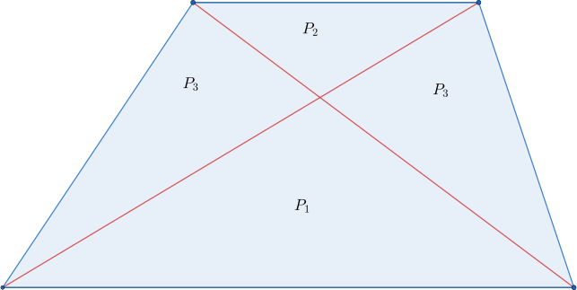
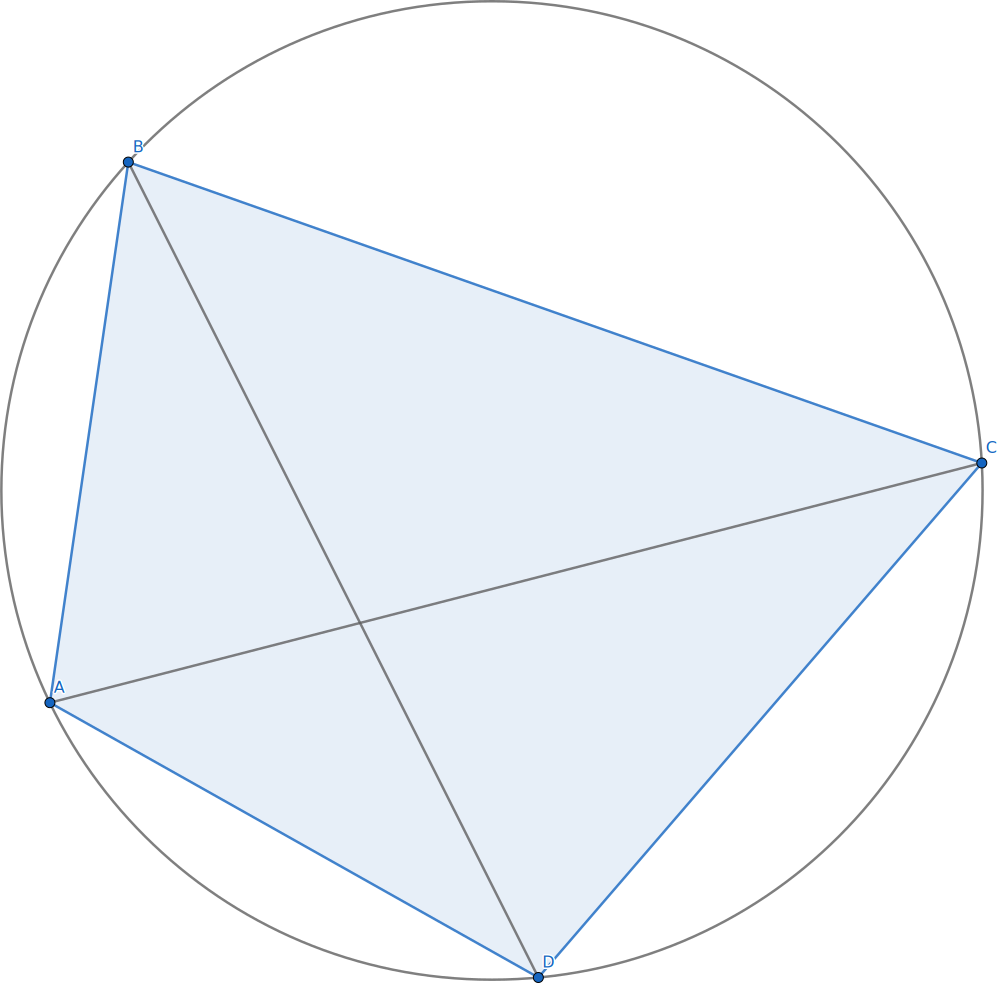
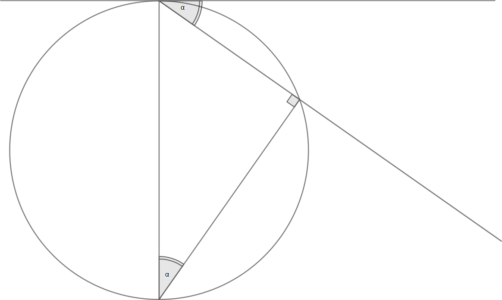
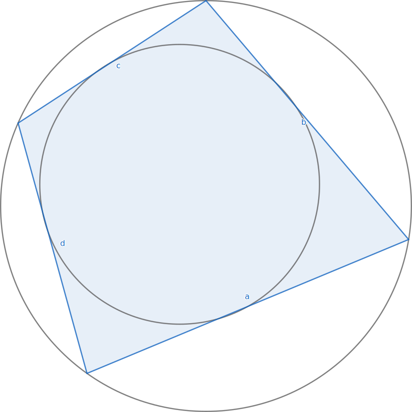
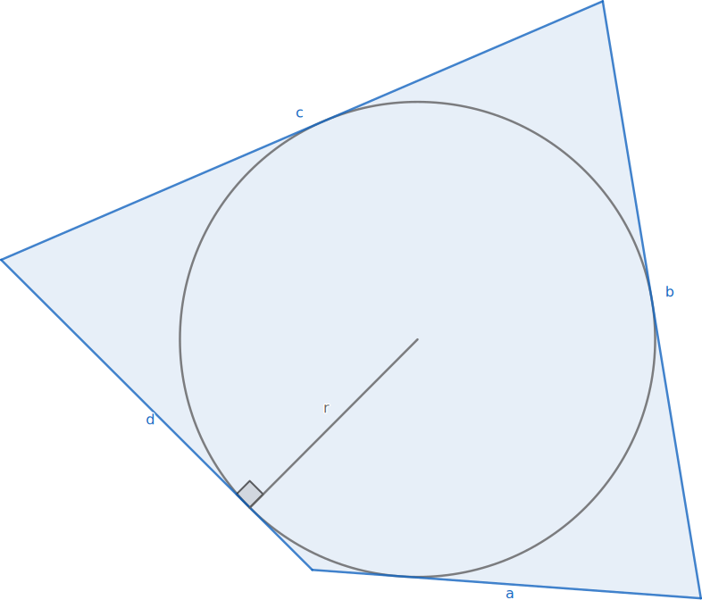
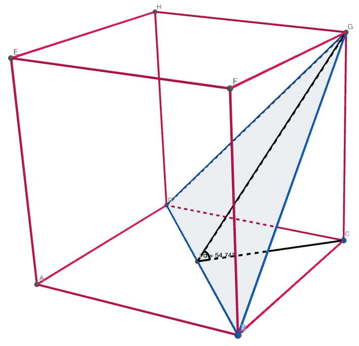

---
html:
    embed_svg: false
---

# Nierówność Cauchy'ego
dla $a_1, a_2, a_3, ..., a_n > 0$ zachodzi nierówność:

$\sqrt{\frac{a_1^2+a_2^2+a_3^2 + a_n^2}{n}} \ge \frac{a_1 + a_2 + ... + a_n}{n} \ge \sqrt[n]{a_1 \cdot a_2 \cdot a_3 \cdot ... \cdot a_n} \ge \frac{n}{\frac{1}{a_1} + \frac{1}{a_2} + \frac{1}{a_3} + ... + \frac{1}{a_n}}$

*$średnia\ kwadratowa \ge średnia\ arytmetyczna \ge średnia\ geometryczna \ge średnia\ harmoniczna$*
*równość zachodzi wtedy, gdy $a_1 = a_2 = ... = a_n$*

# Procent składany
dla $K$ - kapitał końcowy, $K_0$ - kapitał początkowy, $p$ - roczna stopa procentowa, $n$ - liczba lat lokaty, $m$ - liczba okresów kapitalizacji, $v$ - podatek:

$K = K_0 \cdot (1+ (1-v)\cdot\frac{p}{100 \cdot m})^{m \cdot n}$

# Jednostki
$1\ ha = 10\ 000\ m^2$
$1\ a = 100\ m^2$
$1\ t = 1000\ kg$
$1\ l = 1\ dm^3$

# Suma wartości bezwzględnych
Jeśli spełnione jest któreś z równań:

- $|a| + |b| + |c| \le 0$
- $a^2 + b^2 + c^2 \le 0$

to $a=0 \wedge b=0 \wedge c=0$

# Rozkład ułamków

dla $n\in\Z$:

$\frac{1}{n \cdot (n+1)} = \frac{1}{n} - \frac{1}{n+1}$

# Wzory Vieta dla równań 3go stopnia

dla $ax^3 + bx^2 + cx + d =0$:

$x_1 + x_2 + x_3 = -\frac{b}{a}$
$x_1 \cdot x_2\ \ +\ \ x_1 \cdot x_3\ \ +\ \ x_2 \cdot x_3 = \frac{c}{a}$
$x_1 \cdot x_2 \cdot x_3 = -\frac{d}{a}$

# Sumy współczynników wielomianu
- Wyraz wolny:
$W(0)$
- Suma współczynników wielomianu:
$W(1)$
- Suma współczynników przy potęgach **nieparzystych**:
$\frac{W(1) - W(-1)}{2}$
- Suma współczynników przy potęgach **parzystych**:
$\frac{W(1) + W(-1)}{2}$

# Wykazywanie różnowartościowości funkcji
dowód nie wprost: $f(x_1) = f(x_2) \Rightarrow x_1 = x_2$

# Zamiana funkcji trygonometrycznych na równania wymierne
- $sin\ x = \frac{2tg\frac{x}{2}}{1\ +\ tg^2\frac{x}{2}} = \frac{2t}{1\ +\ t^2}$
 
- $cos\ x = \frac{1\ -\ tg^2\frac{x}{2}}{1\ +\ tg^2\frac{x}{2}} = \frac{1\ -\ t^2}{1\ +\ t^2}$
 
- $tg\ x = \frac{2tg\frac{x}{2}}{1\ -\ tg^2\frac{x}{2}} = \frac{2t}{1\ -\ t^2}$

# Związki pól

## W trapezie:

$P_3 = \sqrt{P_1 \cdot P_2} \Leftrightarrow P_3 \cdot P_3 = P_1 \cdot P_2$

## W dowolnym czworokącie wypukłym:

$P_1 \cdot P_3 = P_2 \cdot P_4$

# Twierdzenie Ptolemeusza
*W dowolnym czworokącie ABCD wpisanym w okrąg iloczyn długości przekątnych równy jest sumie iloczynów długości przeciwległych boków*

$|AC| \cdot |BD| = |AB| \cdot |CD| + |BC| \cdot |AD|$

# Twierdzenie o siecznych

$|AE| \cdot |BE| = |DE| \cdot |CE|$

# Kąty dopisany i wpisany
Kąty dopisany i wpisany na tym samym łuku są równe

# Pole czworokąta opisanego na okręgu
## Pole czworokąta jednocześnie wpisanego i opisanego na okregu

$P = \sqrt{abcd}$

## Pole czworokąta opisanego na okręgu

$P=\frac{1}{2} \cdot (a+b+c+d) \cdot r$

# Przekroje sześcianu
|  |  |  |
|:---:|:---:|:---:|
| $tg\ \alpha < \sqrt{2} \Leftrightarrow \alpha < 54^{\circ}$ | $tg\ \alpha = \sqrt{2} \Rightarrow \alpha \approx 54^{\circ}$ | $tg\ \alpha > \sqrt{2} \Leftrightarrow \alpha > 54^{\circ}$ |

# Warunek współliniowości
Warunek współliniowości trzech punktów na płaszczyźnie $A(x_A; y_A)$, $B(x_B; y_B)$, $C(x_C; y_C)$:

$\frac{x_C - x_A}{x_B - x_A} = \frac{y_C - y_A}{y_B - y_A}$

# Kombinatoryka
Rozmiar wyjściowego zbioru: $n$

| . | Rozmiar tworzonego zbioru | Powtórzenia | Kolejność ma znaczenie | Wzór / Liczba możliwości |
|:---:|:---:|:---:|:---:|:---:|
| Permutacja bez powtórzeń | $n$ | :fa-times: | :fa-check: | $P_n=n!$ |
| Permutacja z powtórzeniami | $n$ | :fa-check: (elementy powtarzają się $k_1, k_2, ..., k_m$) | :fa-check: | $\bar{P_n} = \frac{n!}{k_1! \cdot k_2! \cdot ... \cdot k_m!}$ |
| Wariacje bez powtórzeń | $k$ | :fa-times: | :fa-check: | $V^k_n = \frac{n!}{(n-k)!}$ |
|Wariacje z powtórzeniami | $k$ | :fa-check: | :fa-check: | $\bar{V^k_n} = n^k$ |
| Kombinacje bez powtórzeń | $k$ | :fa-times: | :fa-times: | $C^k_n = \binom{n}{k} = \frac{n!}{k! \cdot (n-k)!}$