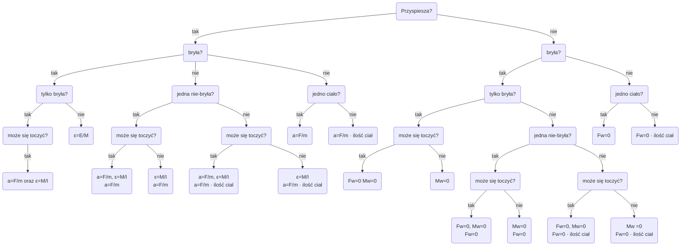

# Mechanika

$S = vt \Leftrightarrow \vec{V} = \frac{d\vec{r}}{dt}$

$\int_{t_0}^{t_1} v(t)\ dt$ _(droga to pole pod wykresem prędkości od czasu)_

# Dynamika

$T=\mu \cdot N=\mu \cdot R$

$F_b = m \cdot a$ *(tylko w układzie nieinercjalnym)*

taki śmieszny algorytm

# Ruch obrotowy
$\omega = \frac{d\alpha}{dt}$

$\omega = \frac{2\pi}{T}$

$V=\omega \cdot R$

$f = \frac{1}{T} = \frac{n}{t}$

Przyczyną przyśpieszenia dośrodkowego jest zmiana kierunku wektora $\vec{V}$

$a_d = \frac{V^2}{R}$

# Praca, Moc, Energia
$E_{kin} = \frac{mV^2}{2}$

$E_{pot} = mgh$

$E_{pot} = - \frac{GMm}{R}$

$E_{pot} = \pm \frac{kQq}{R}$, gdzie $k=\frac{1}{4 \pi \varepsilon_0 \varepsilon_r}$
$\varepsilon_r \approx 1$ dla powietrza

$E_{pot} = \frac{k}{x^2}{2}$

$W=Fr\cdot\cos{\angle(\vec{F}; \vec{r})} \Leftrightarrow W=\vec{F} \circ \vec{r}$

## Zasada zachowania energii

$F_{napedu} + F_{oporu} = 0 \Rightarrow można\ zastosować\ ZZE$

# Bryła sztywna
$M = \vec{r} \times \vec{F} = F \cdot r \cdot \sin{\angle(\vec{r}; \vec{F})}$

$I_A=I_o + m \cdot d^2$, gdzie $I_o$ jest środkiem ciężkości

# Siła Lorenza

$F_l = q\vec{V} \cdot \vec{B} = qVB\sin{\angle(\vec{V}; \vec{B})}$

# Orbita

$r$ - promień wodzący
$B$ - perycentrum
$A$ - abcentrum

# Prąd przemienny
- Zwykły układ: $U_{sk}=\frac{U_m}{\sqrt{2}}$
- Zwykły układ: $U = U_m \cdot \sin{\omega t}$
- Podłączony do diody: $U = \frac{U_m}{2}$
- Podłączony do mostka Gretza: $U=U_m$

# Potencjał

$V_a = \frac{E_{pot}}{q} = \pm \frac{kQ}{R}$

Suma ładunków przed połączeniem $=$ Sumie ładunków po połączeniu

$I = \frac{\Delta q}{\Delta t}$

# Opór

$R=\frac{\rho \cdot l}{S}$

$\Delta R = \Delta T \cdot R$

# Praca i moc prądu
$W = UIt = \frac{U^2}{R} t = I^2 R t$

$F_L = qVB\sin{\angle (\vec{V}; \vec{B})} \Leftrightarrow F_L=q(\vec{V} \circ \vec{B})$
$F_L = IBL\sin{\angle (\vec{B}; \vec{L})} \Leftrightarrow F_{ED}=I(\vec{B} \circ \vec{l})$

# Strumień pola

$\Phi = B S \cos{\angle (\vec{B}; \vec{S})} \Leftrightarrow \Phi = \vec{B} \times \vec{S}$

Wektor powierzchni $\vec{S}$ jest prostopadły do płaszczyzny $S$

$[\Phi] = 1\ T \cdot m^2 = 1\ Wb$

# Zjawisko indukcji elektromagnetycznej

$\varepsilon_{ind} = \frac{\Delta \Phi}{\Delta t}$

$\varepsilon = BlV$

## Reguła Lenza

Kierunek prądu indukcyjnego przeciwdziała zmianom, które go wywołały

# Transformator

$k = \frac{U_1}{U_2} = \frac{n_1}{n_2}$

gdzie $k$ przekładnia transformatora